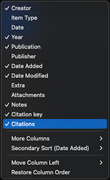

  

# Citation Tally

 

**_Displays citation counts for Zotero library items._**

This is a plugin for [Zotero](https://www.zotero.org), a research source management tool. The _CitationTally_ plugin automatically fetches and displays citation counts for research papers in your library from multiple academic databases.

## Plugin Functions

- **Automatic Citation Tracking** - Fetches citation counts when new items are added to your library
- **Smart Auto-Updates** - Keeps citation data current with configurable update schedules
- **Visual Integration** - Adds a sortable "Citations" column to your Zotero library view
- **Multiple Databases** - Queries Crossref, Semantic Scholar, and INSPIRE in configurable order
- **Intelligent Rate Limiting** - Respects API limits with adaptive throttling
- **Persistent Storage** - Stores citation data in item's Extra field for sync compatibility

Please post any bugs, questions, or feature requests in the [GitHub issues](https://github.com/daeh/zotero-citation-tally/issues?q=is%3Aissue+is%3Aopen+sort%3Aupdated-desc).

## Installation

- Download the plugin (the `.xpi` file) from the [latest release](https://github.com/daeh/zotero-citation-tally/releases/latest)
- Open Zotero (version 7.x or 8.x)
- From `Tools -> Plugins`
- Select `Install Plugin From File...` from the gear icon ⛭
- Choose the `.xpi` file you downloaded (e.g. `citation-tally.xpi`)
- Restart Zotero

## Setup and Configuration

Once installed, the plugin will automatically begin tracking citation counts for items in your library.

### Initial Setup

- **Plugin Activation**: After installation and restart, the plugin will automatically add a "Citations" column to your Zotero library view.
  - The citation count column should automatically appear in your library view.
    - (If you don't see the column, right click the column titles and check "Citations")

    

- **Preferences Access**: Configure the plugin by going to `Zotero -> Settings -> Citation Tally` on MacOS ( `Edit -> Preferences -> Citation Tally` on linux).

### Automatic Behavior

- **New Items**: Citation counts are automatically fetched when items with DOIs or arXiv IDs are added
- **Auto-Updates**: Can be configured to update outdated citations on Zotero startup
- **Smart Scheduling**: Items are processed from newest to oldest based on when they were added to your library

### Manual Actions

- **Update Selected Items**: Right-click → "Update Citation Tallies"
  - **_NB_** Manual updates bypass all retry restrictions and cooldown periods

- **Update All Outdated**: Tools menu → "Retally outdated item citations"
  - This runs at startup but you can also trigger it manually.

### Configuration Options

Database Settings

- **Database Priority Order**: Configure which databases to query and in what order. The plugin will try each database until it finds citation data.
  - Default order: `crossref, semanticscholar, inspire`
  - You can reorder these based on your field and preferences
  - For physics papers, you might prefer: `inspire, crossref, semanticscholar`
  - For general academic papers: `crossref, semanticscholar`

- **Automatic Updates**: Enable automatic citation updates on startup for outdated items
- **Adaptive Rate Limiting**: Smart rate limiting that starts with base delays and automatically increases up to 10x when rate limits are detected, then gradually decreases on success
- **Database-Specific Rate Limits**: Configure individual base rate limits for each database (Crossref, INSPIRE, Semantic Scholar)

### Troubleshooting

Common Issues

- **No citation data found**: The plugin requires items to have DOIs, arXiv IDs, or other identifiers that databases can match. Journal articles, conference papers, and books with DOIs work best. Items like web pages, theses, or older publications without digital identifiers may not have citation data available in academic databases.
- **Rate limiting**: The plugin aims to be respectful of the databases that make citation information available by adaptively throttling request frequency and avoiding unnecessary requests. It starts with base delays (1-3 seconds) and automatically increases delays up to 10x when rate limits are detected, then gradually decreases on successful requests. Large batch updates may take time but will complete automatically. The plugin keeps track of items that do not appear in databases and avoids requesting them frequently, but will periodically check to see these items have been added.
- **Network issues**: Ensure Zotero has internet access and your firewall isn't blocking requests to academic databases.

Advanced Features & Behavior

### Intelligent Retry System

The plugin tracks items that fail to return citation data and intelligently schedules retries:

- **Not Found Items**:
  - 1st attempt: Wait 7 days
  - 2nd attempt: Wait 30 days
  - 3rd attempt: Wait 90 days
  - 4+ attempts: Wait 180 days
- **Manual Override**: Right-click updates bypass all retry restrictions

### Adaptive Rate Limiting

The plugin respects API limits with intelligent throttling:

**Base Delays:**

- Crossref: 1 second
- INSPIRE: 1 second
- Semantic Scholar: 3 seconds

**Adaptive Behavior:**

- Increases delay by 1.5× on rate limit errors (up to 10× maximum)
- Decreases by 0.9× on successful requests
- Maintains separate multipliers for each database

### Performance Optimizations

- **Session Caching**: Items without identifiers are cached for the session
- **Progress Indicators**: Real-time updates during bulk operations
- **Network Detection**: Pauses and retries when network is unavailable
- **Automatic Cleanup**: Monthly removal of data for deleted library items

### Supported Identifiers

The plugin can fetch citations for items with:

- DOIs (Digital Object Identifiers)
- arXiv IDs
- INSPIRE record IDs
- Semantic Scholar paper IDs

## Supported Databases

- **[Crossref](https://www.crossref.org/)**: Comprehensive database for scholarly publications with DOIs
- **[Semantic Scholar](https://www.semanticscholar.org/)**: AI-powered academic search engine with citation analysis
- **[INSPIRE](https://inspirehep.net/)**: High-energy physics literature database

## Related Projects

- **[ZoteroCitationCountsManager](https://github.com/FrLars21/ZoteroCitationCountsManager)** by FrLars21
- **[zotero-citationcounts](https://github.com/eschnett/zotero-citationcounts)** by eschnett

## Notes

[GitHub](https://github.com/daeh/zotero-citation-tally): Source code repository

This extension uses the [zotero-plugin-template](https://github.com/windingwind/zotero-plugin-template).

## License

Distributed under the GNU Affero General Public License v3.0.

## Author

 
